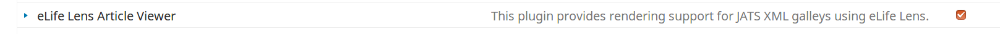
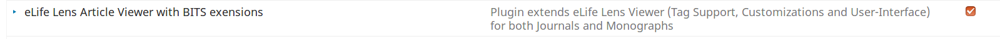

# OJS3  Lens-viewer plugin for [JATS](https://jats.nlm.nih.gov/archiving/) and [BITS](https://jats.nlm.nih.gov/extensions/bits/).

This plugin intergrates an enhanced Version of the Lens Viewer which  supports BITS extensions.

# Description

Browser-based HTML Viewer for Journal Articles and Monographs based on [JATS]((https://jats.nlm.nih.gov/archiving/))-standard XML files.based on elifescience Lens Viewer.

Functionality for [BITS](https://jats.nlm.nih.gov/extensions/bits/) (Book extension for JATS)  is available and constantly enhanced.

##Implemented Extensions

| Feature |	Ready | Live Links in monographs |
| --- | --- | --- |
| Audio/Video from external repositories| ✓ |[demo](https://heiup.uni-heidelberg.de/reader/index/310/310-69-79515-1-10-20171115.xml#figures) |
| Enhanced citation blocks (with unique IDs)   | ✓ | [demo](https://heiup.uni-heidelberg.de/reader/index/43/43-68-231-1-10-20151008.xml#content/box_25) |
| Footnotes formatting support   | ✓ |  [demo](https://heiup.uni-heidelberg.de/reader/index/48/48-68-599-1-10-20160428.xml#footnotes/article_footnote_60)|
| Footnotes internal navigation into references   | ✓ | [demo](https://heiup.uni-heidelberg.de/reader/index/310/310-69-79515-1-10-20171115.xml#figures)|
| Paragraph formatting using CSS-Stylesheets   | ✓ |[read here](https://github.com/withanage/UBHD-Lens/blob/master/README.md#open-your-browser)|
| Quotes (unique ids, formatting supported)  | ✓ | [demo](https://heiup.uni-heidelberg.de/reader/index/48/48-68-599-1-10-20160428.xml#content/quote_2)|
| Section metadata for monographs   | | |
| - Section authors/contributors | ✓ | [demo](https://heiup.uni-heidelberg.de/reader/index/345/345-68-81466-2-10-20180620.xml#content/heading_39) |
| - Section title| ✓ |[demo](https://heiup.uni-heidelberg.de/reader/index/345/345-68-81466-2-10-20180620.xml#content/heading_39)  |
| - Section Abstract | ✓ | [demo](https://heiup.uni-heidelberg.de/reader/index/345/345-68-81466-2-10-20180620.xml#content/heading_39)  |
| Speech-Element | ✓ | [demo](https://heiup.uni-heidelberg.de/reader/index/48/48-68-599-1-10-20160428.xml#content/speech_27)|
| Table display in reading panel | ✓ | [demo](https://heiup.uni-heidelberg.de/reader/index/345/345-68-81466-2-10-20180620.xml#content/html_table_2)|
| Table (unique id for reference)   | ✓ |[demo](https://heiup.uni-heidelberg.de/reader/index/345/345-68-81466-2-10-20180620.xml#content/html_table_2) |
| Table formatting using JATS XML Attributes and CSS-Stylesheets | ✓ | |
| Resizable reader panel | being developped | | 
| Software Source-code in Lens | being developped |[ticket](https://gitlab.ub.uni-heidelberg.de/wit/verlag-portale/issues/161) | 

* Source: https://github.com/withanage/UBHD-Lens 


## OJS 3 Installation
 
### Command line

#### OJS 3.2
```bash
cd $OJS_PATH/plugins/generic/
git clone https://github.com/paflov/ojs-plugin-lens-bits.git lensGalleyBits
# Set rights for the web-user, if necessary. e.g sudo chown -R www-data:www-data lensGalleyBits/
```

### OJS 3.1+
```bash
cd $OJS_PATH/plugins/generic/
git clone https://github.com/paflov/ojs-plugin-lens-bits.git lensGalleyBits
git checkout lens-bits-ojs-3.1
# Set rights for the web-user, if necessary. e.g sudo chown -R www-data:www-data lensGalleyBits/
```
## Configuration

* Navigate to page  $MY_SERVER/$MY_OJS/index.php/$MY_JOURNAL/management/settings/website

* Click on the tab -> plugins

* Disable the following  plugin, if enable.



* Enable this Lens viewer plugin you just downloaded



* Submit your XML file into the journal and enjoy!

## Feature requests, Bugs
https://github.com/paflov/ojs-plugin-lens-bits/issues

## Based on
https://github.com/asmecher/lensGalley


## Developers
* https://github.com/paflov
* https://github.com/withanage
* https://github.com/Vitaliy-1


 
